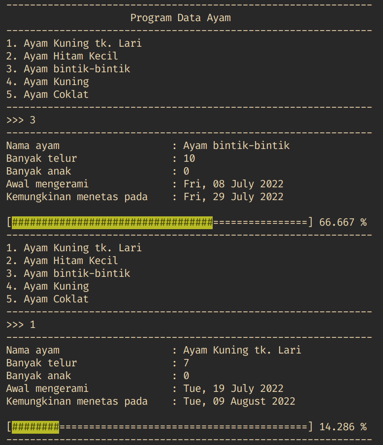

# Data Ayam

Ini adalah program yang dibuat dengan bahasa pemrograman Java. Program ini dapat membantu kita dalam melihat data induk ayam kita.

## Features

Fitur dari program ini :
- Menambah Data Ayam
- Menghapus Data Ayam
- Menampilkan banyak telur ayam
- Melakukan kalkulasi kemungkinan tanggal telur akan menetas
- Melakukan kalkulasi progress dari pengeraman telur
- Menampilkan progress bar dari pengeraman telur serta persentasinya

## About Me

I'm a student at Del Institute of Technology.  
Bachelor of Informatics study program.  

<button><a href="https://www.instagram.com/gabrielhtg77/">My Instagram</a></button>
 
<button><a href="https://www.del.ac.id/">Institut Teknologi Del</a></button>
